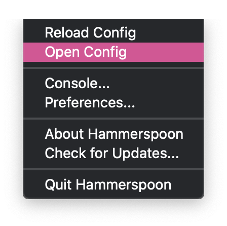
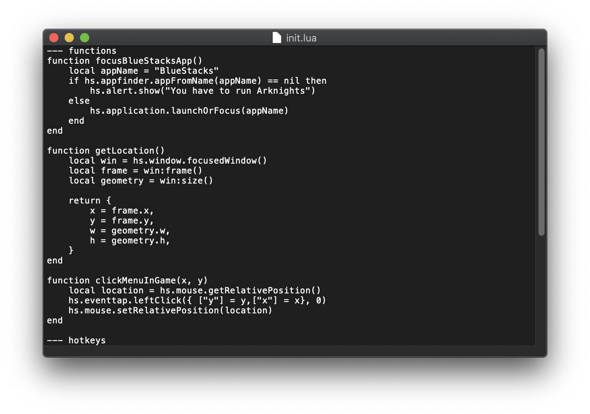
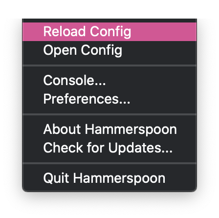

# arknights-helper-keys-for-bluestacks

Arknights helper keys for BlueStacks.

⚠️ Only support macOS.

## Requirements
- [hammerspoon](https://github.com/Hammerspoon/hammerspoon)

## Getting Start
It may not work properly depending on the screen size.

### 1. Open hammerpsoon config

### 2. Copy init.lua in project & Paste hammerspoon config

### 3. Reload hammerspoon config

### Example

### Keyboard q => Pause 

### Keyboard w => Select latest operator

### Keyboard e => 1x, 2x

